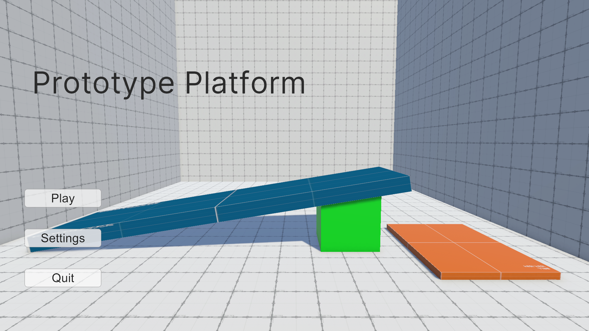
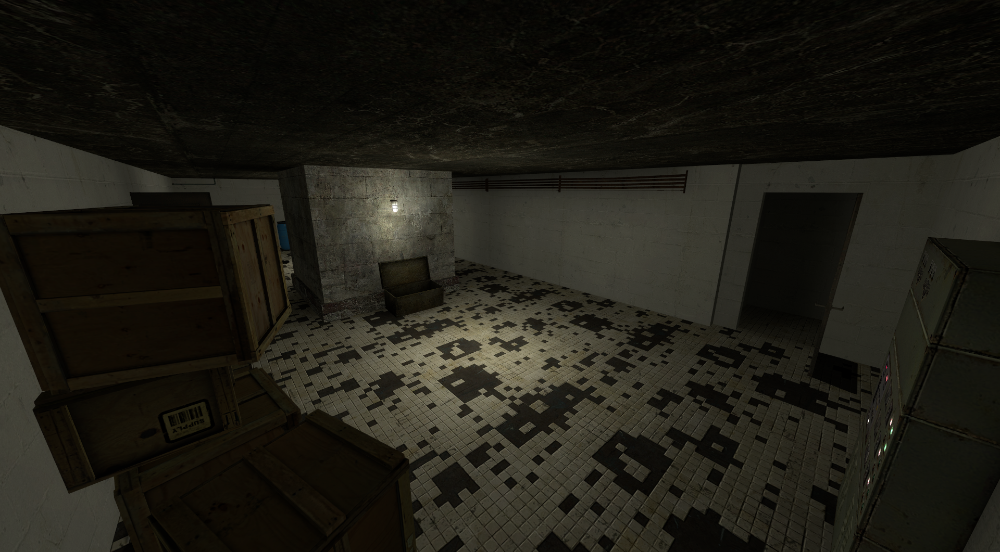
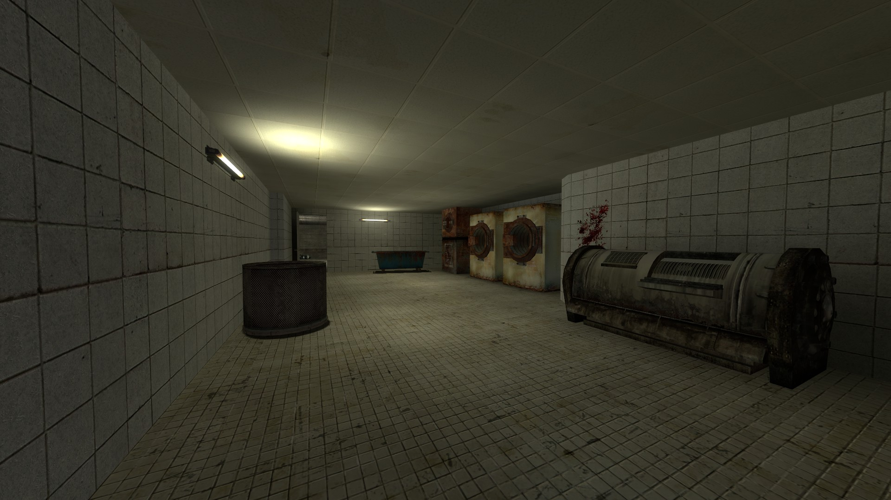
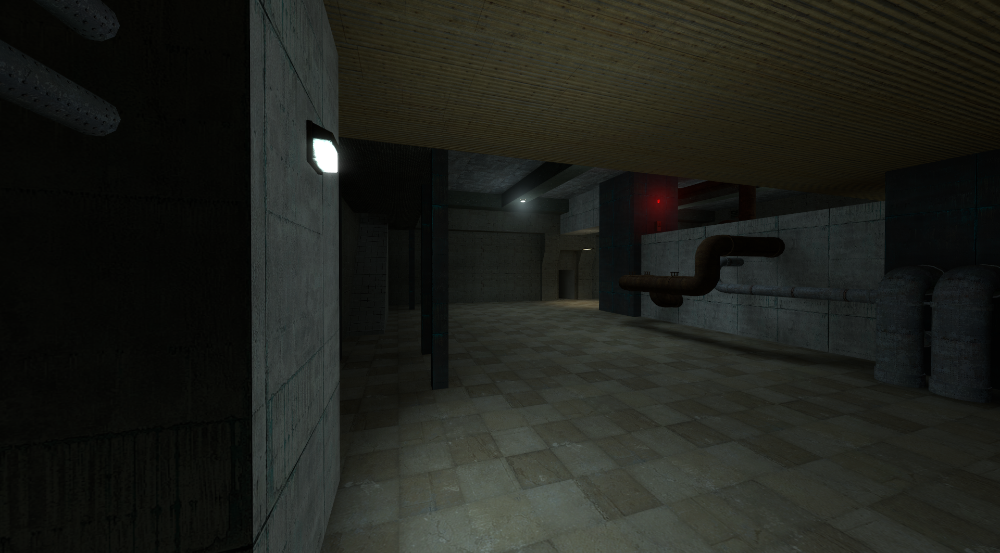
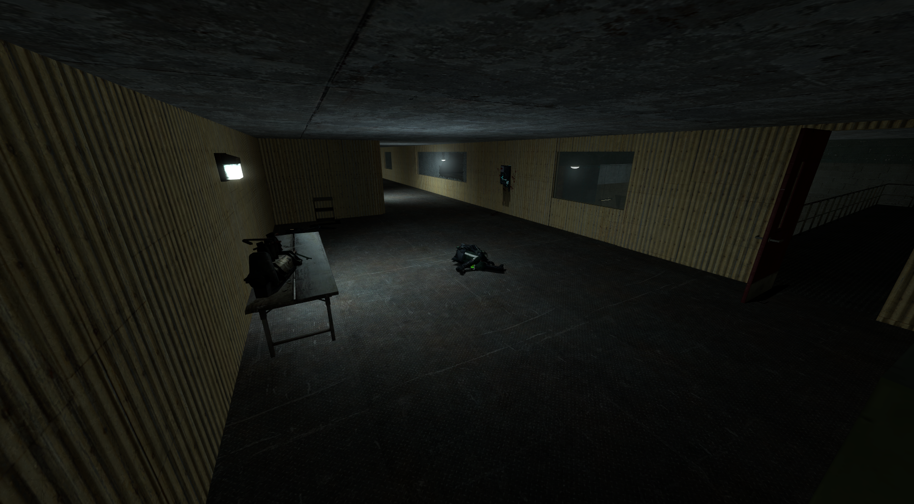
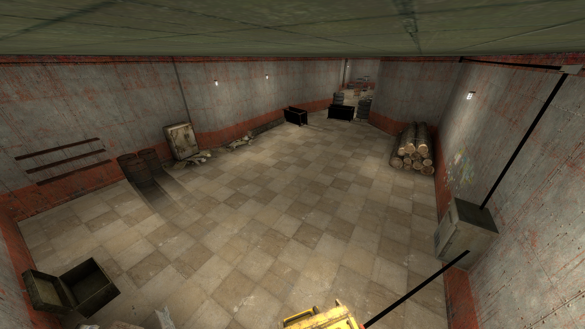
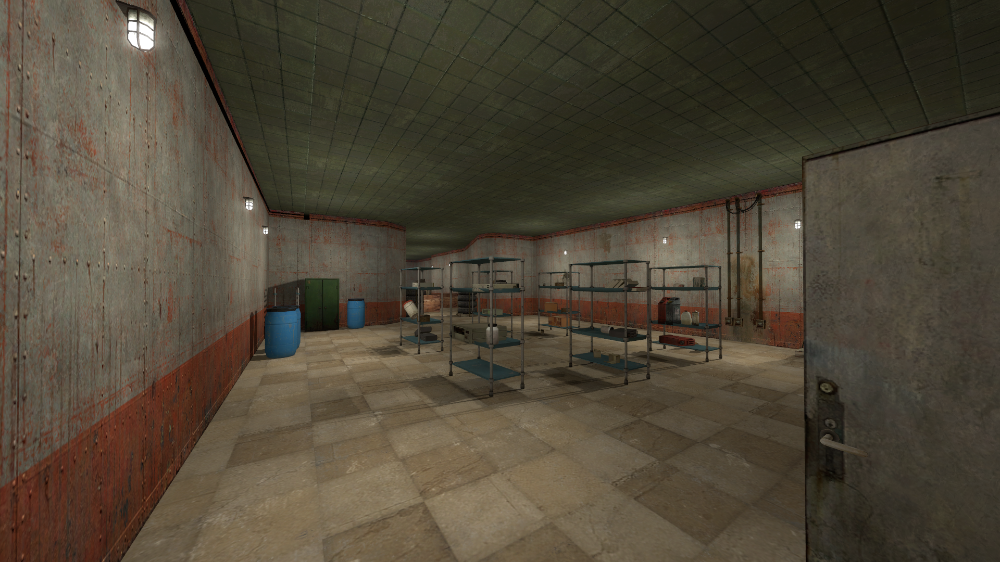
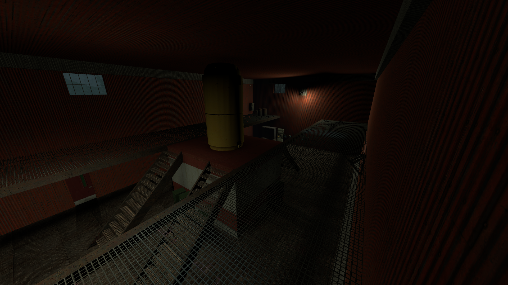
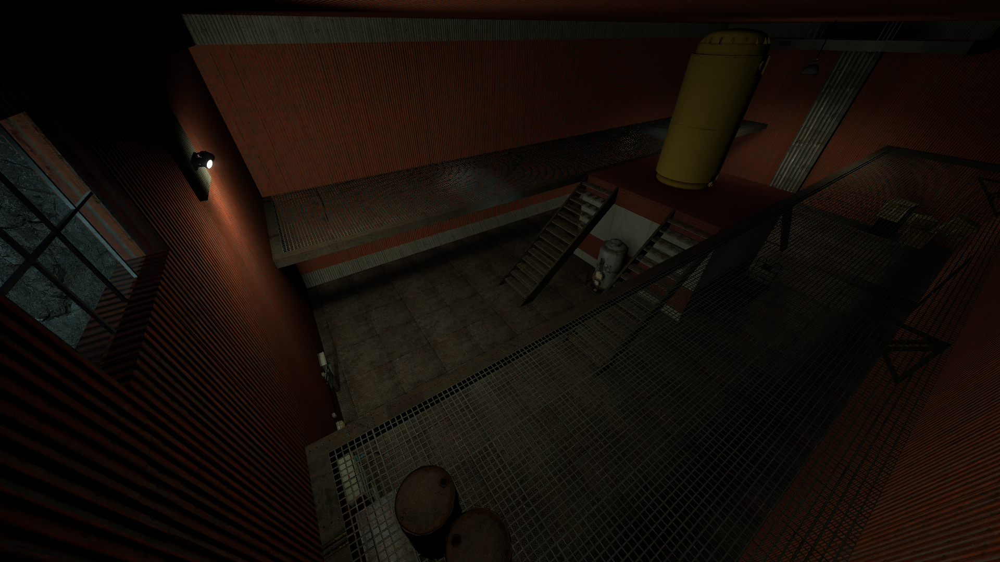
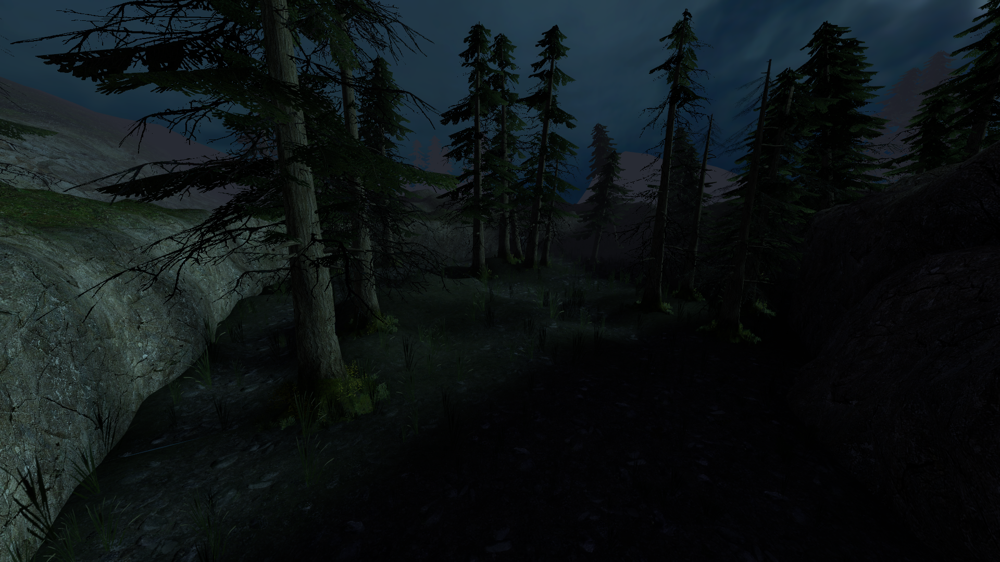

# Hello! I’m Bruno!
I'm an aspiring game developer with a strong interest in **Level Design, Game Design and Programming**. I enjoy making Custom Maps for the Games i love, like **Half-Life 2** and experimenting with gameplay flow and environments. I also have some basic experience with **Blender** in 3D modeling and animation.

# My Personal Projects:

## Prototype Platform

A little experimental platform game I made, inspired by deathrun/BunnyHop maps you can typically find in famous Source Games (Counter-Strike, Half-Life 2, Garry’s Mod, etc.). The game features two levels, the second with branching paths, a little Main Menu with a Level selector and a Volume Slider.

**Features:**
- Two playable levels (one with branching paths)
- Simple main menu with level selection and Volume slider
- Focus on movement, timing, and player flow
<a href="https://gorbar.itch.io/prototype-platform">
You can download and try it on Itch.io
</a>

 
 

  
  

 
 

## A custom Half-Life 2 Episode 2 Map

My first attempt at making a complete map from start to finish to practice Level Design with basic scripting, combat, exploration and puzzle solving. 
<a href="https://gorbar.itch.io/practice-hl2ep2-map">
  You can Download the Map on Itch.io
</a>

 

  
  
  

 
 

## Some practice Animating First Person Animations in Blender

https://github.com/user-attachments/assets/f8187fb4-8ceb-420a-8f78-367f40e56e66
<video src="videos/GunFireAnim.mp4" width="500" controls></video>

https://github.com/user-attachments/assets/c7540c80-6f95-45b9-a686-141e9271a4a3
<video src="videos/GunEquipAnim.mp4" width="500" controls></video>

https://github.com/user-attachments/assets/f3662b8a-794a-47c0-bbae-a3036e2e3959
<video src="videos/GunReloadAnim.mp4" width="500" controls></video>

 

## Work-In-Progress Projects

  
  
  
  
  

<!--
**ShiroyashaII/ShiroyashaII** is a ✨ _special_ ✨ repository because its `README.md` (this file) appears on your GitHub profile.

<video src="videos/GunFireAnim.mp4" width="320" height="240" controls></video>
Here are some ideas to get you started:

- 🔭 I’m currently working on ...
- 🌱 I’m currently learning ...
- 👯 I’m looking to collaborate on ...
- 🤔 I’m looking for help with ...
- 💬 Ask me about ...
- 📫 How to reach me: ...
- 😄 Pronouns: ...
- ⚡ Fun fact: ...
-->
